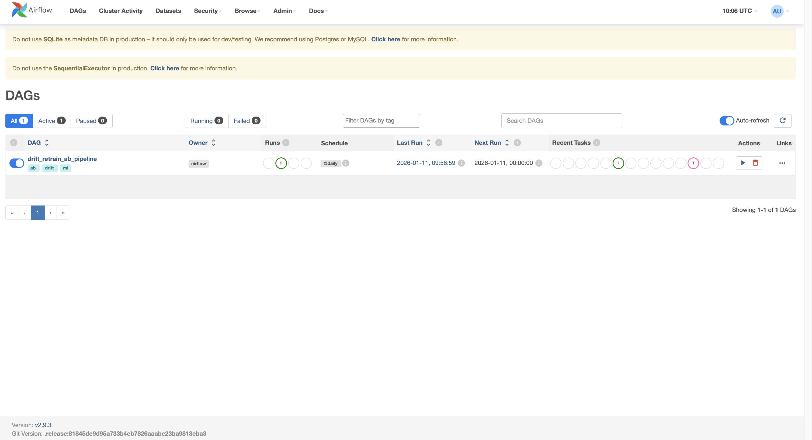
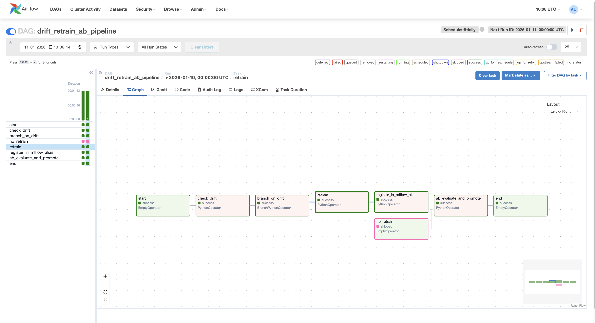
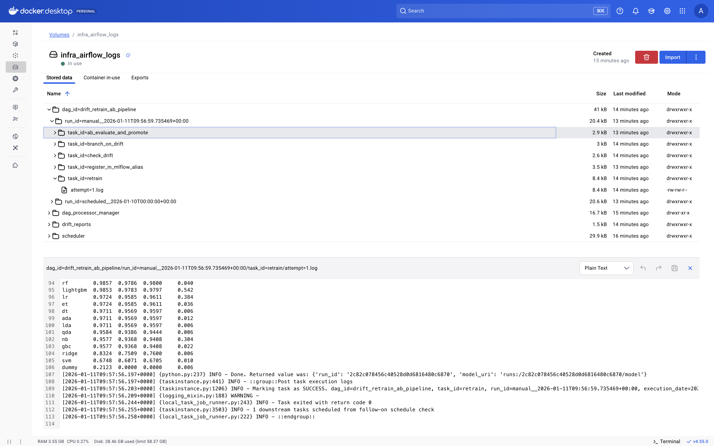
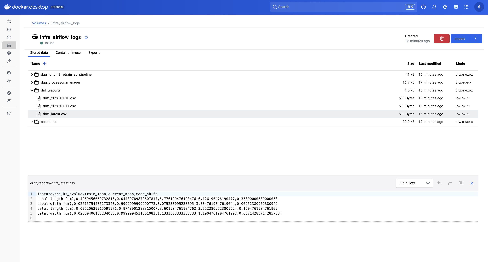
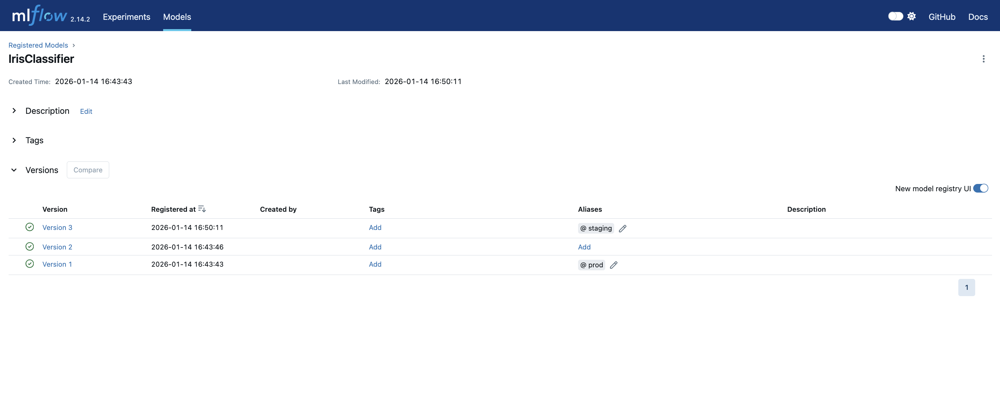
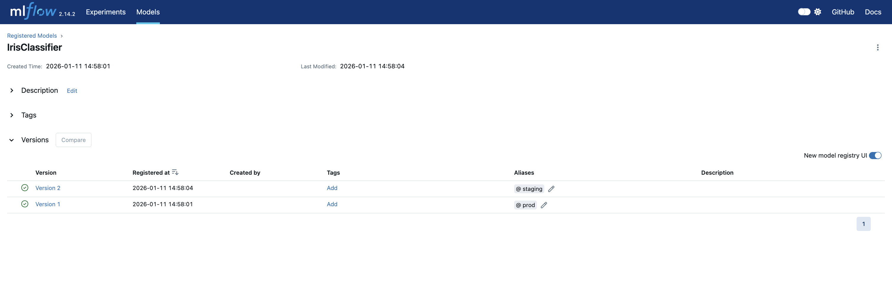
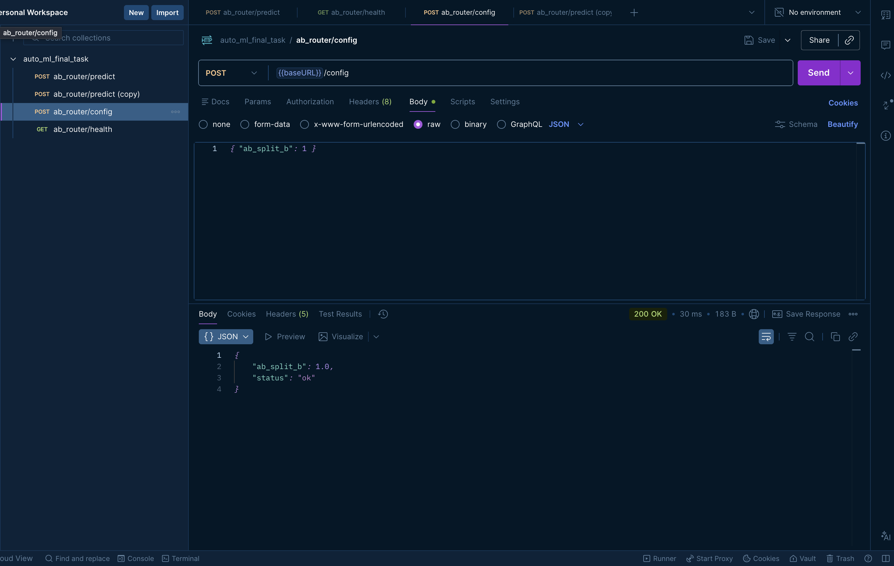
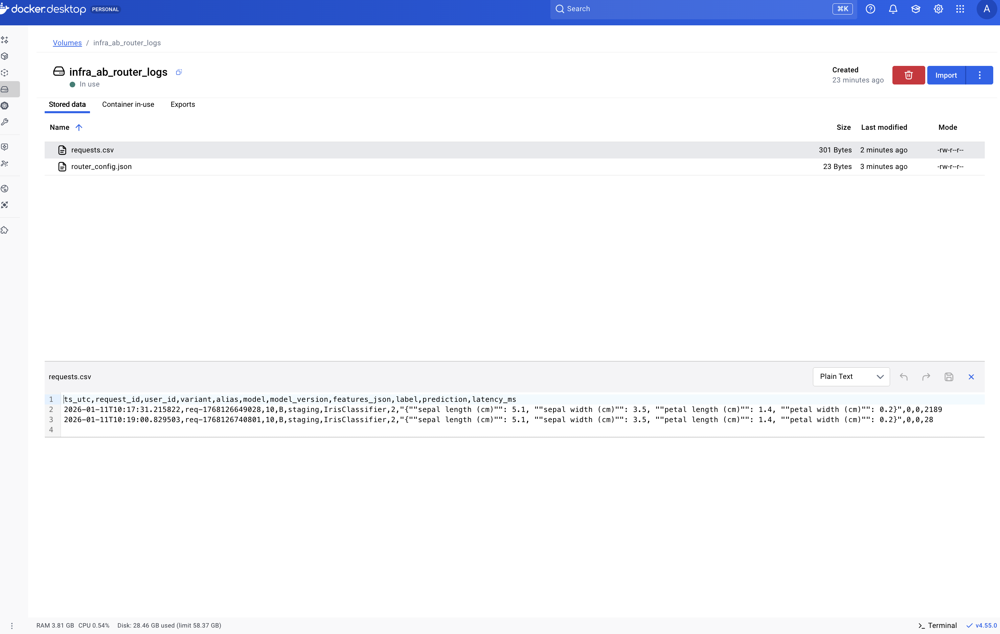

# Итоговый результат работы

В рамках задания реализован полный production-процесс машинного обучения - **от мониторинга data drift до A/B-тестирования и принятия решения о переводе модели в production**.

Проект реализован на учебном датасете *Iris* и сфокусирован на построении MLOps-инфраструктуры.

## 1. Airflow DAG

Реализован Airflow DAG, который:

- регулярно может запускаться по расписанию;
- выполняет мониторинг data drift между обучающими и текущими данными;
- при превышении заданного порога drift автоматически инициирует переобучение модели;
- запускает AutoML-процесс и регистрирует новую модель в MLflow.

    
    
    

## 2. Мониторинг data drift

Для контроля drift используются статистические метрики (PSI, KS-test).

Если значение drift превышает заданный threshold - автоматически запускается переобучение модели.

Результаты мониторинга сохраняются в отчётах.

    

## 3. PyCaret AutoML

Переобучение модели реализовано полностью автоматически с помощью PyCaret:

- `setup`
- `compare_models`
- `finalize_model`

Ручные шаги отсутствуют.  
Все параметры, метрики и артефакты экспериментов логируются в MLflow.

    
    

## 4. Регистрация модели в MLflow

После обучения лучшая модель автоматически регистрируется в **MLflow Model Registry**.

Используются алиасы:
- `staging` - новая кандидатная модель;
- `prod` - текущая production-версия.

Переход в production осуществляется **только после успешного A/B-тестирования**.

    

## 5. Flask A/B-роутер

Реализован Flask API-роутер, который:

- принимает входящие запросы `/predict`;
- распределяет трафик между моделями A (prod) и B (staging);
- поддерживает динамическое изменение доли трафика (`ab_split_b`);
- логирует все запросы и предсказания.

    
    

## 6. Логирование запросов

Все запросы сохраняются в единый log-файл (CSV):

- user_id;
- вариант A/B;
- версия модели;
- входные признаки;
- предсказание;
- истинная метка (label, при наличии).

Логи используются для последующего анализа качества моделей.

    

